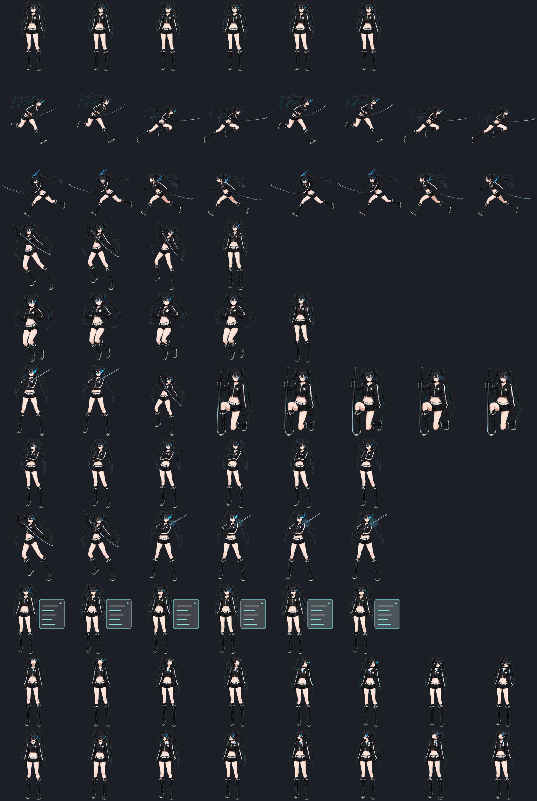

> ⭐ 如果这个项目对你有帮助，欢迎点个 Star 支持一下！制作与维护不易，也欢迎通过赞助支持项目持续更新。
> ⭐ If this project helps you, a Star is appreciated. Ongoing development and maintenance take time, and sponsorship is welcome.

# BLACK★ROCK SHOOTER — Codex Pet

一个可显示 Codex 任务状态的自定义 Pet。角色会根据空闲、运行、等待、检查、失败等状态切换动画；武器只在对应动作中出现。



## 直接安装

### 方法一：下载 Release（推荐）

1. 在仓库右侧打开 **Releases**，下载最新的 `BLACK-ROCK-SHOOTER-pet.zip`。
2. 解压后，在终端进入解压目录并执行：

   ```bash
   chmod +x install.sh
   ./install.sh
   ```

3. 打开 Codex → **设置 → 宠物**，刷新列表并选择 **BLACK★ROCK SHOOTER**。

### 方法二：从源码安装

```bash
git clone https://github.com/Mars535821089-ops/BLACK-ROCK-SHOOTER.git
cd BLACK-ROCK-SHOOTER
chmod +x install.sh
./install.sh
```

安装位置：

```text
~/.codex/pets/blueflame/
├── pet.json
└── spritesheet.webp
```

因此换电脑后只需重新下载仓库或 Release，再运行一次安装脚本。

## ChatGPT 网页版上传

网页版直接上传完整的 v2 精灵图：[下载 BLACK★ROCK SHOOTER 原版 WebP](dist/blueflame/spritesheet.webp)。在 ChatGPT 网页版打开 **设置 → 虚拟宠物 → 上传虚拟宠物**，名称填写 `BLACK★ROCK SHOOTER`，选择下载的 WebP 文件，再点击 **上传**。桌面版宠物不会自动同步到网页。

原图为 1536 × 2288、透明背景、8 × 11 网格；保留全部状态动画和视线方向帧。网页版是否成功接收及实际动画效果仍需上传后确认。

## 显示规格

- Codex Pet Sprite v2
- 8 × 11 网格
- 单格 192 × 208
- 精灵表 1536 × 2288，WebP 透明背景
- 73 个有效动画帧
- 支持 Codex 官方宠物尺寸 80 / 113 / 224

## 开发与验证

需要 Node.js 20 或更高版本：

```bash
npm ci
npm run typecheck
npm test
npm run validate:pet
npm run build:pet
npm run test:e2e
```

README 中的默认安装流程不会修改 Codex 应用本体；`install.sh` 只写入用户目录下的自定义宠物文件夹。

## 版权说明

这是非官方的同人自定义宠物项目，与 OpenAI 或原角色权利方没有隶属或认可关系。代码按 [MIT License](LICENSE) 提供；角色名称、形象与相关素材权利归各自权利方所有。
